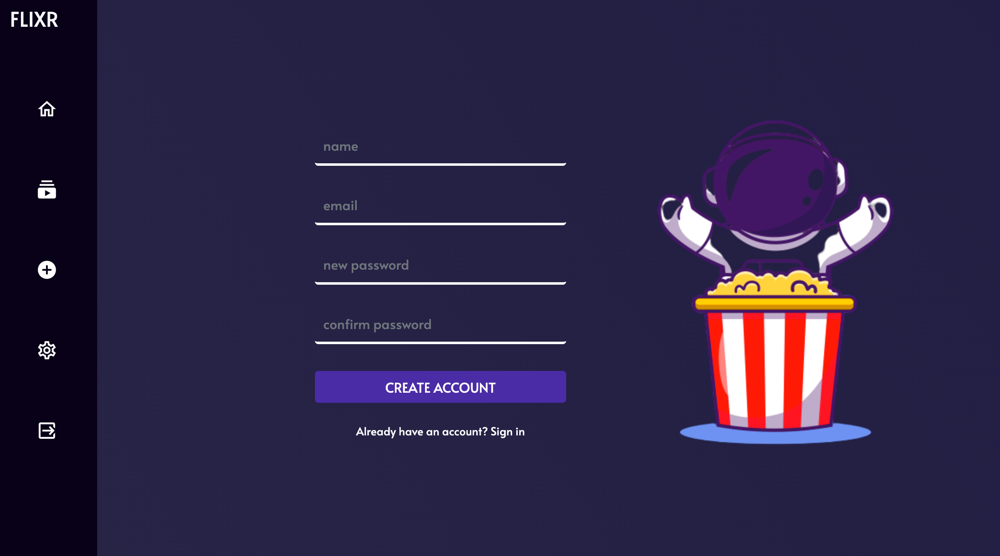
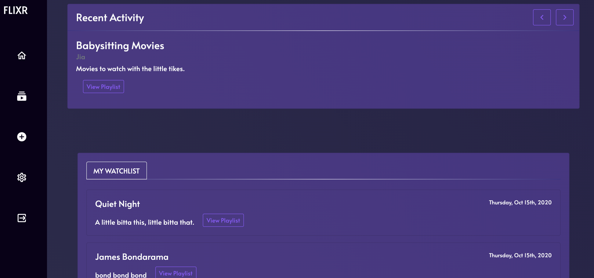
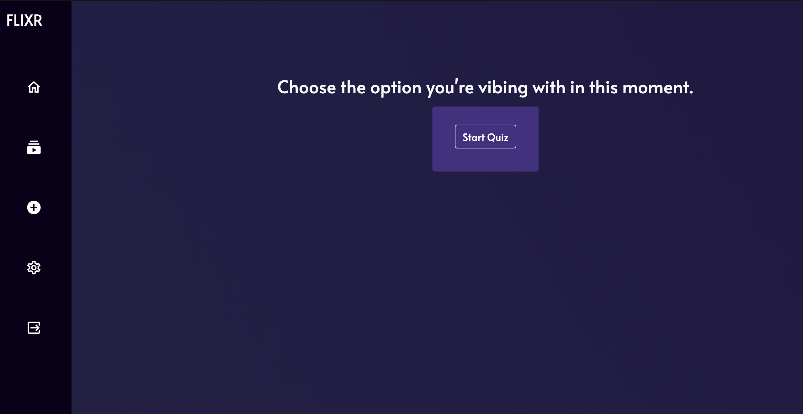
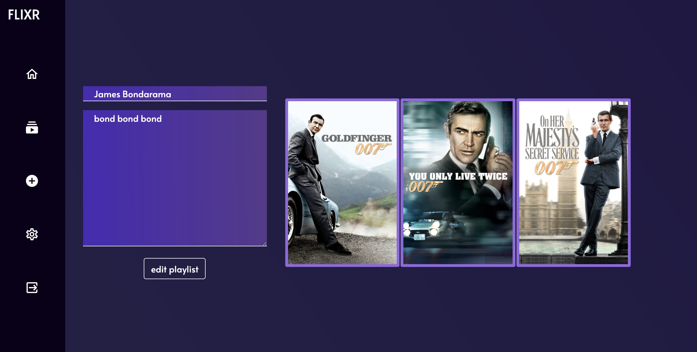
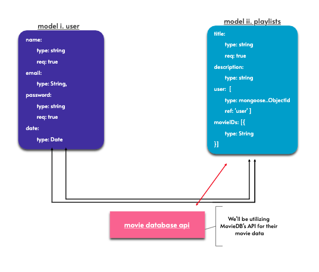

# Flixr 

[Flixr](http://flixr-io.herokuapp.com/) is a movie search engine powered by user responses to a simple multiple-choice quizlet.

## Index:

- [Scope](#Scope)
- [User Stories](#user-stories)
- [Wireframes](#wireframes)
- [Data Models](#data-models)
- [Milestones](#milestones)

## Scope

Our objective was to create an app that makes use of [The Movie Database API](https://developers.themoviedb.org/4/getting-started/authorization) to find movies for its users according to their preferences at the moment and allow the user to build and edit their playlist, while also being able to see the activity of other users on their dashboard.

##### Technologies Used

- NodeJs
- bcrypt
- body parser
- passport
- dotenv
- express/sessions
- mongoDB
- mongoose
- axios
- bootstrap

## User Stories

- New users can register and log in once they reach the landing page.
- Users can view their playlists on their dashboard, as well as the 5 most recent playlists made by all users of Flixr.
- Users can create playlists by taking a short, 10-question quizlet, designed to illicit a different response on each taking of the quiz. This is to find movies that best match the mood of the user at that moment in time.
- Once their movies have been selected, they can review their playlist and give it a name and an optional description.
- Once the playlists have been made, they can be viewed from the user's dashboard and edited or deleted.

## Wireframes

### Log In / Register

On Flixr's landing page, the user may log in, or register if they don't have an account.

### Dashboard

The user dashboard shows recent activity on the site, with the logged-in user's playlists displayed below.

### Start Quiz

To make a new playlist, the user takes a short quizlet.

### Edit Page

Once the playlist has been made, it can be viewed, edited, or deleted.

## Data Models

## Milestones

#### Sprint 1 - October 9 - 12

- Users can see a landing page with a description of Flixr
- Users can see a log-in form
- Users can see a registration form
- Users can see and take a quiz to determine the type of movies to search for on TMDB
- Users can see a playlist show page with their chosen movies

#### Sprint 2 - October 13

- Users can see an edit and delete button on their show page
- Users can see an edit page to update their playlist

#### Sprint 3 - October 14

- Users can see a dashboard of their playlists
- Users can see the recent activity of other users

#### Sprint 4 - October 15

- Users can see their playlists displayed in a visually appealing way